# Spherical Harmonic Tools

Copyright &copy; 2012&ndash;2013 &mdash; [Robert Kooima](http://kooima.net)

This module provides a straightforward implementation of the real spherical harmonic transform and its inverse. It uses the orthonormalized associated Legendre functions, generated by an m-varying recurrence. The implementation is expressed in terms of the Cooley-Tukey fast Fourier transform, so the running time of both synthesis and analysis is O(n3) and n must be a power of two. It is parallelized using OpenMP and will use all available processor cores.

- [sh.hpp](sh.hpp)
- [shtrans.cpp](shtrans.cpp)
- [shimage.cpp](shimage.cpp)
- [sherror.cpp](sherror.cpp)
- [Makefile](Makefile)

## Command Line Tools

A few command line tools are provided to directly apply the transform to real image data. These tools are compiled with [this image handling module](http://kooima.net/util3d/image.html), which supports input and output of TIFF, PNG, JPEG, and OpenEXR files of any supported depth. For reliable resynthesis, it is _highly_ recommended that frequency-domain images be stored using 32-bit floating point samples in TIFF format, which are the defaults.

### Spherical Harmonic Analysis

`shtrans    [-FDL] [-o output] [-b bytes] input`

Given a `2n` &times; `2n` spatial-domain input image, perform a spherical harmonic analysis of degree `n` and produce an `n` &times; `n` frequency-domain output image.

- `-o output`

    Output file name. Default is "out.tif".

- `-b bytes`

    Output depth in bytes per sample. 1 requests 8-bit unsigned integer. 2 requests 16-bit unsigned integer. 4 selects selects 32-bit float.

- `-F`
  `-D`
  `-L`

    Perform the computation using `float`, `double`, or `long double` values. Default is `long double`.

### Spherical Harmonic Synthesis

`shtrans -i [-FDL] [-o output] [-b bytes] input`

Given an `n` &times; `n` frequency-domain input image, perform a spherical harmonic synthesis of degree `n` and produce a `2n` &times; `2n` spatial-domain output image.

- `-o output`

    Output file name. Default is "out.tif".

- `-b bytes`

    Output depth in bytes per sample. 1 requests 8-bit unsigned integer. 2 requests 16-bit unsigned integer. 4 selects selects 32-bit float.

- `-F`
  `-D`
  `-L`

    Perform the computation using `float`, `double`, or `long double` values. Default is `long double`.

### Storage of Spherical Harmonics

Spatial domain images are stored in a normal 2n &times; 2n raster with the top of the image corresponding to the north pole of the sphere. Frequency domain images are stored as an n &times; n raster with the following layout. Degree zero is placed at the upper left and the degree increases moving toward the lower right. Negative orders are stored in the rows and positive orders in the column, putting the "zonal" harmonics of order zero along the diagonal. This table shows the degree and order (l, m) corresponding to each pixel of an 8 &times; 8 image.

<table class="grid">
<tr><td>0,        0</td><td>1,       +1</td><td>2,       +2</td><td>3,       +3</td><td>4,       +4</td><td>5,       +5</td><td>6,       +6</td><td>7, 7</td></tr>
<tr><td>1, &ndash;1</td><td>1,        0</td><td>2,       +1</td><td>3,       +2</td><td>4,       +3</td><td>5,       +4</td><td>6,       +5</td><td>7, 6</td></tr>
<tr><td>2, &ndash;2</td><td>2, &ndash;1</td><td>2,        0</td><td>3,       +1</td><td>4,       +2</td><td>5,       +3</td><td>6,       +4</td><td>7, 5</td></tr>
<tr><td>3, &ndash;3</td><td>3, &ndash;2</td><td>3, &ndash;1</td><td>3,        0</td><td>4,       +1</td><td>5,       +2</td><td>6,       +3</td><td>7, 4</td></tr>
<tr><td>4, &ndash;4</td><td>4, &ndash;3</td><td>4, &ndash;2</td><td>4, &ndash;1</td><td>4,        0</td><td>5,       +1</td><td>6,       +2</td><td>7, 3</td></tr>
<tr><td>5, &ndash;5</td><td>5, &ndash;4</td><td>5, &ndash;3</td><td>5, &ndash;2</td><td>5, &ndash;1</td><td>5,        0</td><td>6,       +1</td><td>7, 2</td></tr>
<tr><td>6, &ndash;6</td><td>6, &ndash;5</td><td>6, &ndash;4</td><td>6, &ndash;3</td><td>6, &ndash;2</td><td>6, &ndash;1</td><td>6,        0</td><td>7, 1</td></tr>
<tr><td>7, &ndash;7</td><td>7, &ndash;6</td><td>7, &ndash;5</td><td>7, &ndash;4</td><td>7, &ndash;3</td><td>7, &ndash;2</td><td>7, &ndash;1</td><td>7, 0</td></tr>
</table>

This is a useful layout as it casts an otherwise triangular structure into a square and distinguishes low-frequency harmonics from high-frequency. Together, these properties allow frequency domain images to be edited with common image editing software, enabling interactive spherical harmonic filtering.

### Visualization of Spherical Harmonics

`shimage [-o output] [-b bytes] [-l l] [-m m] [-n n]`

This tool synthesizes an example image of a single spherical harmonic function of degree `l` and order `m`. Positive values are rendered in green and negative values in red. The resulting `n` &times; `n` image is helpful in understanding the appearance and behavior of the spherical harmonics.

- `-o output`

          Output file name. Default is "out.tif".

- `-b bytes`

    Output depth in bytes per sample. 1 requests 8-bit unsigned integer. 2 requests 16-bit unsigned integer. 4 selects selects 32-bit float.

- `-l l`

    Harmonic degree. Default is 0.

- `-m m`

    Harmonic order. Default is 0.

- `-n n`

    Synthesis degree, which determines output image size.

Here we see the first eight degrees and orders synthesized at degree 64. They are laid out in an 8 &times; 8 grid as described by the table above. The zonal harmonics are clearly visible along the diagonal and the increasing frequency is obvious toward the right and down.

### Validation of Spherical Harmonics

`sherror [-FDL] [-n degree]`

- `-n degree`

    Analysis degree. Default is 1.

- `-F`
  `-D`
  `-L`

    Perform the computation using `float`, `double`, or `long double` values. Default is `long double`.

This tool quantifies the performance and precision of the implementation. It begins with white noise, defined as frequency coefficients of one for all `l` and `m` up to `n`. These coefficients are synthesized at a resolution of `2n` &times; `2n`, and re-analyzed up to degree `n`. The round trip time is measured, and the output frequency coefficients are compared with one, giving root-mean-square error and maximum error. Upon completion, a table of results in printed to `stdout` including the degree n, the run time in seconds, the RMS error, the log2 RMS error, the maximum error, and the log2 maximum error. The log2 results indicate the number of bits to which the output agrees with the input, thus quantifying the numerical stability of synthesis together with analysis. Several runs of this tool are graphed below.

## API

Each of these tools uses a spherical harmonic transformation template library given in the file `sh.hpp`. Templating allows the transform to be calculated using `float`, `double`, or `long double` built-in types. User-defined types are even supported if they overload the basic arithmetic operators and include a few of the functions of the math library.

- `sht<real>::sht(int n, int c)`

    Construct a spherical harmonic transform object. All internal computation will be performed using the `real` type. The frequency domain representation has order n the spatial domain representation has order 2n &times 2n. c gives the number of channels of both.

This object has public attributes for input and output. `S` is a `w` &times; `h` spatial domain image with `c` channels of type `real`. `F` is an `n` &times; `n` frequency domain image with `c` channels of type `real`. These images overload the function operator allowing direct access to their contents.

- `real& Flm<real>::operator()(int l, int m, int k)`

    Give a reference to the frequency sample at degree `l`, order `m`, and channel `k` suitable for reading or writing.

- `real& Sij<real>::operator()(int i, int j, int k)`

    Give a reference to the spatial sample at row `i`, column `j`, and channel `k` suitable for reading or writing.

With either the spatial domain or frequency domain image set, analysis or synthesis may be performed.

- `void sht<real>::ana()`

    Perform a spherical harmonic analysis of `S` giving `F`.

- `void sht<real>::syn()`

    Perform a spherical harmonic synthesis of `F` giving `S`.

When performing image IO, both `S` and `F` support bulk transfer functions that automatically cast to and from the internal floating point type to 32-bit floating point.

- `void Flm<real>::set(const float *data, int N)`  
  `void Flm<real>::get(float *data)`

    Transfer 32-bit floating point data into or out of the frequency domain image. The `set` buffer argument provides `N` &times; `N` &times; `c` 32-bit floats, which accommodates the specification of a truncated set of coefficients with `N` *not* a power of two. The `get` buffer argument must accommodate `n` &times; `n` &times; `c` 32-bit floats where `n` is a power of two.

- `void Sij<real>::set(const float *src)`  
  `void Sij<real>::get(float *dst)`

    Transfer 32-bit floating point data into or out of the spatial domain image. The `data` buffer must accommodate `2n` &times; `2n` &times; `c` 32-bit floats.

In both cases, passing a null pointer to the `set` function initializes the contents of the buffer to zero.

## Examples

This segment of code shows the basic usage of the API for analysis. A square floating point source image with power-of-two size is read from a file and a floating point destination buffer is allocated. A double precision SHT object is instanced with the desired degree and image parameters supplied to the constructor. The spatial domain input is set and the analysis is performed. Finally, the frequency domain output is acquired and written to a file. Synthesis is similar.

    src = image_read_float("input.tif", &n, &n, &c, &b);
    dst = (float *) calloc(n * n * c, sizeof (float);

    sht<double> T(n, c);

    T.S.set(src);
    T.ana();
    T.F.get(dst);

    image_write_float("output.tif", n, n, c, b, dst);

The following examples demonstrate the application of the spherical harmonic tools to real-time environment mapping. We begin with this 24-bit 512 &times; 256 spherical panorama of a swamp.

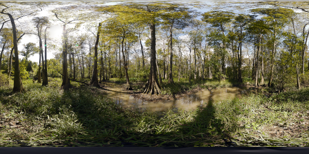

It's a common practice to map such an image onto a model to generate the appearance of a reflective mirror finish or a refractive glass material.

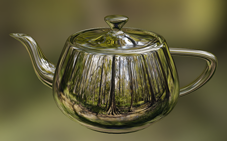

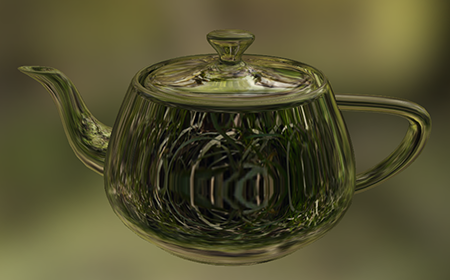

Applying the spherical harmonic transform to the swamp image allows us to generalize the appearance of such materials. To begin, the swamp image was analyzed at `n`=512 giving a 32-bit 512 &times; 512 floating point frequency domain image. This output was loaded into Photoshop and cropped to 64 &times; 64 at the upper left. This crop represents only the first 64 degrees of low-frequency information in the input.

We can immediately resynthesize this into a low-frequency spatial domain image of the swamp, but to do so would generate high-frequency artifacts knows as Gibbs phenomenon, as cropping behaves like a "brick wall" filter. To circumvent this, we can apply a simple triangular filter window using Photoshop's gradient tool. We drag from the top-left to the bottom-right with a diamond-shaped white-black gradient in multiply mode. This fades out the high frequency artifacts, leaving the low frequency information intact.

Here's what that looks like. The pixel values are very small and appear black, so the image has been tone-mapped for display here.

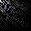

Synthesizing this image produces a blurred swamp. Critically, however, this is not a simple 2D blur like that produced by a Photoshop filter. Instead, it behaves as though the blur radius were uniform at every point on the sphere, including the poles. In contrast, a 2D blur of a spherical image would behave as if the blur became increasingly thin toward the poles, producing unsightly artifacts there.

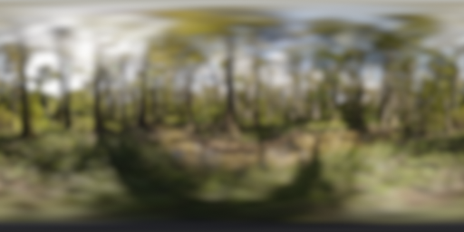

Applying the blurred image to the model shows an imperfect reflection and a frosted refraction, giving a much more natural and realistic material. In addition, all of these images use the 64-degree blurred image as a backdrop, giving the appearance of shallow focus regardless of view direction.

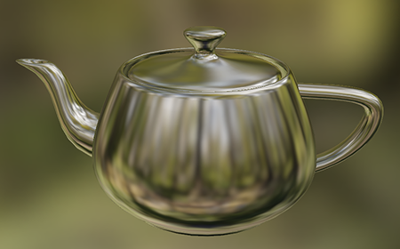

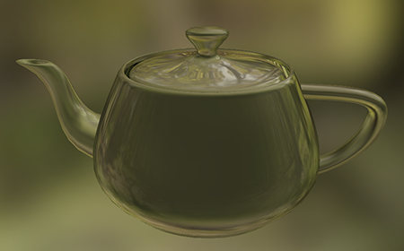

We can take this a step further. Here, the frequency-domain image of the swamp is cropped to only 32 &times; 32, and the diamond gradient applied.

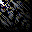

With only 32 degrees of spherical harmonics, only the very low frequencies remain.

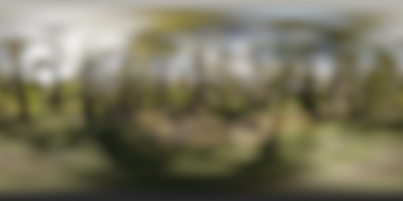

The resulting reflection no longer resembles chrome, and instead takes on the character of pewter or brushed aluminum. In comparison, the perfect reflection provided by the original unfiltered environment map looks downright fake.

It's worth noting that a little blur goes a long way toward refraction environment mapping, and the 32-degree refraction is nearly indistinguishable from the 64-degree refraction.

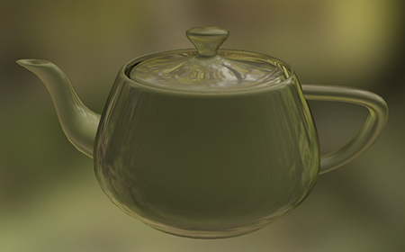

These are all specular illumination effects, but the spherical harmonic transform provides a means to extend environment mapping into diffuse illumination, as described by Ramamoorthi and Hanrahan in their 2001 SIGGRAPH paper [An Efficient Representation for Irradiance Environment Maps](http://graphics.stanford.edu/papers/envmap/). In this work, Ramamoorthi and Hanrahan note that diffuse illumination is essentially convolution against a cosine-weighted hemisphere, and demonstrate that the resulting "irradiance" need be represented using only three degrees of spherical harmonics.

To put this in action, we crop the 512 &times; 512 frequency domain image down to only 3 &times; 3. Here we see the result magnified.

The diffuse illumination hemisphere is represented in the frequency domain with a single value per degree, 3.141593 at degree zero, 2.094395 at one, and 0.785398 at two, which are presented analytically in the paper. Here we see that image, also magnified, and tone-mapped so as not to saturate at white. Here is the [original 3 &times; 3 floating point irradiance](etc/irr.tif) stored in a TIFF.

We can load these two images into Photoshop layers, multiply them, and flatten. Synthesizing the result produces the following environment map. This is a perfectly diffuse behavior with no specularity, as if the teapot were now made of clay.

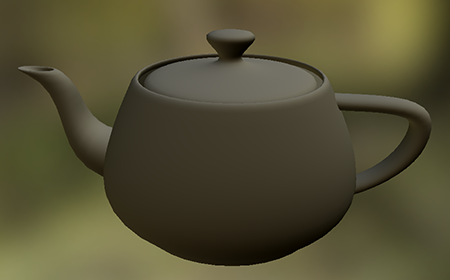

Underscoring the efficiency of their efficient representation for irradiance environment maps, Ramamoorthi and Hanrahan also provide example environments (via Paul Debevec) in the form of three sets of spherical harmonic coefficients. We present them here using the 32-bit floating point TIFF frequency domain representation: [Grace Cathedral](etc/grace_cathedral.tif), [Eucalyptus Grove](etc/eucalyptus_grove.tif), and [St. Peter's Basilica](etc/st_peters_basilica.tif). They look like this, scaled and tone-mapped.

We can trivially synthesize these to give more irradiance environment maps, just as above.

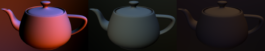

## Tests

Here we presents some of the output of the `sherror` tool. The task is performed at degrees `n`= 21, 22, 23, 24, 25, 26, 27, 28, 29, 210, 211 and 212 using single, double, and long double precision floating point values. The software was compiled for OSX 10.8 using g++ 4.7.2. The test hardware used 2 &times; 2.0 GHz eight-core Intel Xeon E5 processors. Data shown here was collected using 16 OpenMP threads.

Here are the round trip times, with time in seconds plotted on a log-10 scale. Single precision floating point performance is shown in red, double in green, and long double in blue. G++'s `long double` is in fact an Intel-native 80-bit float, which is the same type that implements single and double precision calculation, so performance parity is not a big surprise. Their stored size varies though, so these results would indicate that the process is not cache-bound on this hardware. The computation is effectively instantaneous when `n` is smaller than 6 and the resolution of the timer was not sufficient to demonstrate any distinction.

Here we see the agreement between the input and the round trip output. Specifically, this graph shows the average number of bits to which each pair of values coincides, as given by the base-2 log of their root-mean-square difference. Single precision floating point (in red) gives at most 24 bits of useful precision and sees a precipitous drop in stability past `n`=24, with a total failure past `n`=27. Double precision (in green) gives 50 bits and sees a similar limit at `n`=27. Long double (in blue) continues to `n`=211. This places an upper bound on the input size that this utility can usefully handle when instanced using native data types: 2048.

Here is the base-2 log maximum difference. Again, it shows the number of binary digits to which the input and output values agree. The results are largely the same as the RMS, and this test is done merely to demonstrate that the RMS does not average away any outliers.

These numbers show that the current implementation is useful in a number of circumstances, but not as powerful as we would like. The use of extended-range arithmetic (Lozier &amp; Smith) will take us beyond the inevitable failure of long double precision, and a GPU-cluster implementation will extend the performance envelope by sheer brute force.

On the bright side, the spherical harmonic transform is a trivially parallelizable process that fully benefits from all floating point capacity placed at its disposal. He we see the speed-up of the round trip test run at `n`=29 in double precision with from one to 32 threads. Speed-up is linear to 16 threads, with 90% efficiency, as this is the number of real processor cores in the test system. They're hyperthreaded cores, and modest gains can be achieved by overcommiting them, though this is not reliable.

